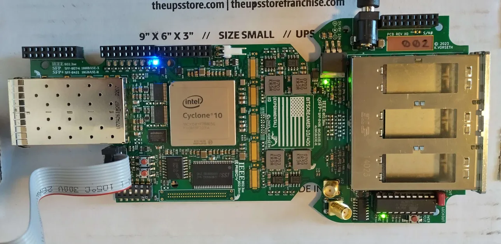

# Hello world design for custom `BitScreamer` FPGA board

This project contains the design files for a simple `led blink` project in
order to get more familiar with the custom `BitScreamer` board and quartus `Signal Tap`.



## Quick start

The following commands are to be run from the `tcl` directory.

To create the quartus project, build the design, run timing and program the FPGA
with our simple design, run :

```bash
make build
```

Once the FPGA has been programmed, to launch signal tap, run :

```bash
make tap
```

